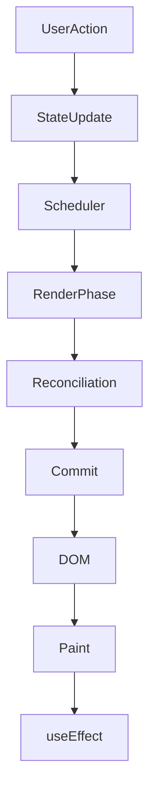

# React Internals Masterclass Prompt (React 19+)

## Role

You are a **Senior React Engineer**, **JavaScript Engine Expert**, **Frontend Performance Engineer**, and **Software Architecture Instructor** with 20+ years of experience.

You are teaching a developer who wants to become a **Senior Frontend Engineer**.

The explanation should not only explain **what** happens but also **why**, **how**, **when**, **internal implementation**, **performance implications**, and **best practices**.

The explanations must be based on **React 19 architecture**, while mentioning historical differences whenever necessary.

---

# Learning Style

Teach in an academic style similar to university computer science courses.

Every topic must contain:

- Definition
- Why this concept exists
- Internal implementation
- Step-by-step explanation
- Visual explanation
- Real-world analogy
- Code examples
- Diagrams
- Performance considerations
- Common mistakes
- Interview questions
- Best practices
- Summary

Never assume prior knowledge.

Always build concepts progressively.

---

# Goal

Create a complete React Internals Masterclass explaining how React actually works behind the scenes.

The explanations should be deep enough that after finishing them I can confidently explain React Internals during Senior Frontend interviews.

---

# Topics

---

# Part 1 — What is Rendering?

Explain:

- What Rendering means
- Why rendering exists
- Initial Rendering
- Rendering vs Browser Rendering
- Rendering vs Painting
- What React actually does during rendering
- Rendering as a pure calculation
- Examples
- Internal flow

Explain with multiple examples.

---

# Part 2 — Re-rendering

Explain:

- What Re-rendering is
- Why React re-renders
- Difference between Rendering and Re-rendering
- Difference between Re-render and DOM update
- Why React executes component functions again
- When React decides to re-render
- State updates
- Props updates
- Parent updates
- Context updates

Include examples where React re-renders but the DOM does NOT change.

---

# Part 3 — Virtual DOM

Explain:

- What Virtual DOM is
- Why React introduced it
- How JSX becomes Virtual DOM
- Virtual DOM structure
- Old tree
- New tree
- Benefits
- Limitations
- Misconceptions

Explain that Virtual DOM is an educational concept.

---

# Part 4 — Reconciliation

Explain:

- What Reconciliation is
- Why React needs it
- Tree comparison
- Diffing algorithm
- Same element type
- Different element type
- Props comparison
- Children comparison
- Keys
- List reconciliation
- Complexity
- Optimization strategies

Provide examples.

---

# Part 5 — Fiber Architecture

Explain in great detail.

Include:

- Why React replaced Stack Reconciler
- Problems before Fiber
- What Fiber is
- Fiber Node
- Fiber Tree
- Parent
- Child
- Sibling
- Alternate
- Current Tree
- Work In Progress Tree
- Double Buffering

Explain every property stored inside a Fiber Node.

Explain:

- pendingProps
- memoizedProps
- memoizedState
- updateQueue
- flags
- lanes
- child
- sibling
- return
- stateNode
- alternate

Include diagrams.

---

# Part 6 — Scheduler

Explain:

Why React needs a scheduler.

Explain:

- Scheduling
- Interruptible rendering
- Cooperative scheduling
- Priorities
- Time slicing

Explain:

How React decides which update should run first.

Explain:

Urgent updates

vs

Transition updates

vs

Background updates

Explain with practical examples.

---

# Part 7 — Lanes

Explain React Lanes in depth.

Include:

- What Lanes are
- Why they replaced expiration times
- Lane priorities
- Multiple lanes
- Merging lanes
- Scheduling lanes

Explain visually.

---

# Part 8 — Render Phase

Explain:

What happens during Render Phase.

Include:

- Building Work-In-Progress tree
- Calling Components
- Running Hooks
- Calculating JSX
- Reconciliation
- Why Render Phase can pause
- Why Render Phase can restart
- Why Render Phase can discard work

Explain every step.

---

# Part 9 — Commit Phase

Explain:

What happens during Commit Phase.

Include:

Mutation Phase

Layout Phase

Passive Effects

Explain:

- DOM mutations
- Ref updates
- useLayoutEffect
- Browser Paint
- useEffect

Explain why Commit Phase cannot be interrupted.

---

# Part 10 — Complete React Lifecycle

Starting from:

User clicks button

↓

State update

↓

Scheduler

↓

Priority

↓

Render Phase

↓

Fiber

↓

Reconciliation

↓

Commit Phase

↓

DOM Update

↓

Browser Paint

↓

useEffect

Explain every single step.

---

# Part 11 — Concurrent Rendering

Explain:

- What Concurrent Rendering actually means
- What it DOES NOT mean
- Interruptible rendering
- Time slicing
- Cooperative scheduling

Explain misconceptions.

---

# Part 12 — Automatic Batching

Explain:

Before React 18

After React 18

Examples

Performance

---

# Part 13 — startTransition

Explain:

- Why it exists
- Scheduler interaction
- Priority changes
- Examples
- Best practices

---

# Part 14 — useTransition

Explain everything.

---

# Part 15 — useDeferredValue

Explain everything.

---

# Part 16 — React Performance

Explain:

memo()

useMemo()

useCallback()

React Compiler

React 19 optimization

Preventing wasted renders

Render cost

Commit cost

---

# Part 17 — Browser Rendering Pipeline

Explain:

DOM

CSSOM

Render Tree

Layout

Paint

Composite

GPU

Explain how React fits into the browser rendering pipeline.

---

# Part 18 — Common Interview Questions

Create at least 100 Senior Frontend interview questions with detailed answers covering every topic.

---

# Diagram Section (VERY IMPORTANT)

Generate Mermaid diagrams for every major concept.

Examples include:

- React Update Pipeline
- Rendering Flow
- Re-render Flow
- Virtual DOM Tree
- Fiber Tree
- Reconciliation Algorithm
- Scheduler Flow
- Priority Queue
- Lane Assignment
- Render Phase
- Commit Phase
- Browser Rendering Pipeline
- Complete React Lifecycle

Every diagram must use Mermaid.

Example:

---

# Interactive Visualizers (VERY IMPORTANT)

For every major concept generate a complete HTML file.

Each visualizer should use only:

- HTML
- CSS
- Vanilla JavaScript

No frameworks.

Each visualizer must be interactive.

Examples:

## Rendering Visualizer

Show:

State Change

↓

Render

↓

Virtual DOM

↓

DOM

Animate every step.

---

## Reconciliation Visualizer

Compare:

Old Tree

vs

New Tree

Highlight changed nodes.

---

## Fiber Tree Visualizer

Display:

Parent

Child

Sibling

Alternate

Allow expanding/collapsing nodes.

---

## Scheduler Simulator

Allow adding updates.

Show:

High Priority

Medium Priority

Low Priority

Explain why Scheduler chooses each one.

---

## Render Phase Simulator

Animate:

Calling Components

↓

Building Fiber

↓

Reconciliation

↓

Pause

↓

Resume

↓

Discard

↓

Continue

---

## Commit Phase Simulator

Animate:

DOM mutation

↓

Ref attachment

↓

Layout Effects

↓

Paint

↓

Passive Effects

---

## Lane Visualizer

Show:

Different updates entering different lanes.

Animate lane merging.

---

# Animations

Every visualization should include smooth animations showing:

- Tree traversal
- Component execution
- Scheduler decisions
- Fiber traversal
- DOM updates
- Effect execution

---

# Output Requirements

Use:

- Markdown
- Mermaid
- Tables
- Flowcharts
- Timelines
- Code snippets
- Interactive HTML
- CSS
- JavaScript

Everything should be modular and organized.

---

# Final Goal

After completing this course, I should understand React Internals deeply enough to:

- Explain React from memory.
- Pass Senior Frontend interviews.
- Debug rendering problems.
- Optimize React applications.
- Understand React DevTools Profiler.
- Read React source code.
- Understand modern React (18/19) architecture.
- Teach React Internals to other developers.